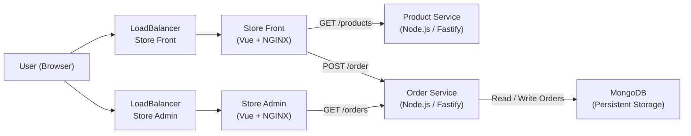

# 🛒 Best Buy Cloud-Native Microservices Application (AKS + MongoDB)

---

Vijay Xavier Walter.     
041276252.     
CST8915 Full-stack Cloud-native Development.      
Winter 2026.      

---

## 📌 Project Overview

This project is a **cloud-native microservices application** deployed on **Azure Kubernetes Service (AKS)**.
It simulates a Best Buy–style system where users can browse products, place orders, and admins can manage/view those orders.

The system follows a **microservices architecture** and uses **MongoDB for persistent storage**.

---

## 🎥 Demo Video

👉 *(https://youtu.be/rEgFFaY3_Mc)*

---

## 🏗️ Architecture Diagram



---

## 🏗️ Architecture Components

* **Store Front** → Customer UI (Vue + NGINX)
* **Store Admin** → Admin UI (Vue + NGINX)
* **Product Service** → Provides product data  
* **Order Service** → Handles order creation & retrieval  
* **MongoDB** → Stores orders persistently

---

## 🔁 Application Flow

1. User opens Store Front → fetches products from `product-service`
2. User places order → request goes to `order-service`
3. `order-service` stores order in **MongoDB**
4. Store Admin fetches orders from `order-service`
5. Orders are retrieved from MongoDB

---

## 🧰 Technologies Used

* Docker 🐳
* Kubernetes (AKS) ☸️
* Node.js  
* MongoDB 🍃
* NGINX
* Azure CLI
* GitHub

---

## 📂 Project Structure

```text
bestbuy-cloud-native-deployment/
│
├── namespace.yaml
├── mongodb-deployment.yaml
├── mongodb-service.yaml
├── product-service-deployment.yaml
├── product-service-service.yaml
├── order-service-deployment.yaml
├── order-service-service.yaml
├── store-front-deployment.yaml
├── store-front-service.yaml
├── store-admin-deployment.yaml
├── store-admin-service.yaml
```

---

## 🔗 Links Table (Required)

| Component                    | Link                                                               |
| ---------------------------- | ------------------------------------------------------------------ |
| Store Front Repo             | *(add GitHub link)*                                                |
| Store Admin Repo             | *(add GitHub link)*                                                |
| Product Service Repo         | *(add GitHub link)*                                                |
| Order Service Repo           | *(add GitHub link)*                                                |
| Deployment Repo              | *(add GitHub link)*                                                |
| Docker Hub - Product Service | https://hub.docker.com/r/vijayxavierwalter/bestbuy-product-service |
| Docker Hub - Order Service   | https://hub.docker.com/r/vijayxavierwalter/bestbuy-order-service   |
| Docker Hub - Store Front     | https://hub.docker.com/r/vijayxavierwalter/bestbuy-store-front     |
| Docker Hub - Store Admin     | https://hub.docker.com/r/vijayxavierwalter/bestbuy-store-admin     |

---

## 🐳 Docker Images

| Service         | Image                                            |
| --------------- | ------------------------------------------------ |
| Product Service | vijayxavierwalter/bestbuy-product-service:latest |
| Order Service   | vijayxavierwalter/bestbuy-order-service:latest   |
| Store Front     | vijayxavierwalter/bestbuy-store-front:latest     |
| Store Admin     | vijayxavierwalter/bestbuy-store-admin:latest     |

---

## ☸️ AKS Deployment Instructions

### 1️⃣ Create Resource Group

```bash
az group create --name rg-bestbuy-aks --location canadacentral
```

### 2️⃣ Create AKS Cluster

```bash
az aks create \
  --resource-group rg-bestbuy-aks \
  --name bestbuy-aks-cluster \
  --node-count 1 \
  --generate-ssh-keys
```

### 3️⃣ Connect to AKS

```bash
az aks get-credentials \
  --resource-group rg-bestbuy-aks \
  --name bestbuy-aks-cluster
```

### 4️⃣ Deploy Application

```bash
kubectl apply -f namespace.yaml
kubectl apply -f .
```

### 5️⃣ Verify Deployment

```bash
kubectl get pods -n bestbuy
kubectl get svc -n bestbuy
```

---

## 🌐 Application URLs

| Service     | URL                 |
| ----------- | ------------------- |
| Store Front | http://4.172.68.214 |
| Store Admin | http://4.172.67.89  |

---

## 🗄️ MongoDB Integration

### Why MongoDB?

Initially, the application used **in-memory storage**, which caused data loss when containers restarted.
MongoDB was introduced to provide **persistent, scalable storage**.

---

### MongoDB Connection

```text
mongodb://mongodb:27017
```

---

### Environment Variables (Order Service)

```yaml
env:
  - name: MONGO_URL
    value: "mongodb://mongodb:27017"
  - name: MONGO_DB_NAME
    value: "bestbuy"
  - name: MONGO_COLLECTION_NAME
    value: "orders"
```

---

## 🧪 MongoDB Testing

### ✔ Persistence Test

1. Place an order
2. Restart service:

```bash
kubectl rollout restart deployment order-service -n bestbuy
```

3. Refresh admin

👉 Order still exists → MongoDB working

---

### ✔ Direct Database Query

```bash
kubectl exec -it deploy/mongodb -n bestbuy -- mongosh
```

```js
use bestbuy
db.orders.find().pretty()
```

---

## 👨‍💻 Author

**Vijay**

---

## 📢 Conclusion

This project demonstrates:

* Microservices architecture
* Docker containerization
* Kubernetes orchestration (AKS)
* Persistent storage using MongoDB
* End-to-end cloud-native deployment

---
